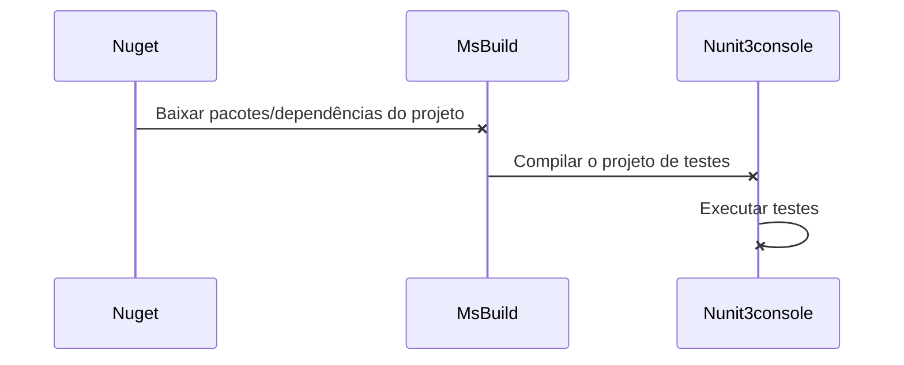
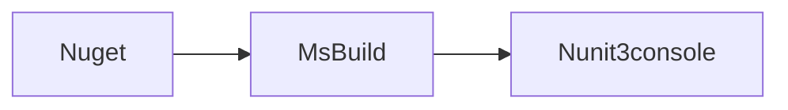

# Mantis - Mariadb + Docker + SeleniumGrid/Node + Integração Contínua + POM

  

Este projeto foi criado com o intuito de praticar padrões e metas de um projeto de automação de UI, o mesmo foi desenvolvido em C#.

Caso você utilize parte deste projeto, peço que faça referência ao autor como forma de comentário no seu projeto. Gratidão (=


## Metas deste projeto:

 
-  **1. Preparação do ambiente:** utilizar Mantis para execução de automação de testes;

-  **2. 50 Scripts:** Implementar 50 scripts de testes que manipulem uma aplicação web Mantis utilizando PageObjects.

-  **3. Data Driven Testing:** Alguns scripts devem ler dados de uma planilha Excel para implementar Data-Driven.

-  **4. Selenium Grid:** Os casos de testes precisam ser executados em no mínimo três navegadores. Utilizando o Selenium Grid e um arquivo de configuração que determina o navegador que será usado.

-  **5. Screenshots:** Gravar screenshots ou vídeo automaticamente dos casos de testes.

-  **6. Report de execução:** O projeto deverá gerar um relatório de testes automaticamente com screenshots ou vídeos embutidos. Sugestões: Allure Report ou ExtentReport.

-  **7. Conexão banco de dados:** A massa de testes deve ser preparada neste projeto, seja com scripts carregando massa nova no BD ou com restore de banco de dados.

-  **8. Javascript em uso:** Um dos scripts deve injetar Javascript para executar alguma operação na tela. O objetivo aqui é exercitar a injeção de Javascript dentro do código do Selenium.

-  **9. Integração Contínua:** Testes deverão ser agendados pelo Jenkins, CircleCI, TFS ou outra ferramenta de CI que preferir.

  
  

# 1. Preparação do ambiente Mantis

  

Serão necessárias as seguinte configurações para iniciar o projeto:

**Docker-compose:**  no projeto, é possível encontrar um arquivo chamado "docker-compose.yml", este arquivo tem as devidas configurações da aplicação que foi automatizada, seu banco de dados e o framework de execução remota de testes automatizados. Cole o mesmo no diretório C:\mantis:

**1.1 Preparação Mantis + MariaDB**

  

1.  Instalar [Docker Toolbox](https://docs.docker.com/toolbox/toolbox_install_windows/)

3. Executar o software *Docker Quickstart Terminal*

4. Acessar o diretório "C:/mantis" através do terminal aberto no passo anterior

5. No diretório haverá o arquivo **docker-compose.yml**

6. Executar o comando> `docker-compose.exe up -d`

7. Após o processamento, para validar execute o comando `docker ps -a` e os contêineres estarão disponíveis.

  

**1.2 Configuração máquina remota**


1. Com o tópico 1.1 já realizado, executar no *Docker Quickstart Terminal*, o comando `docker-machine ip` e coletar a informação

2. Abrir o software VirtualBox (última versão deverá estar instalada)

3. Encontrar a imagem referente ao docker

4. Acessar "Configurações"

5. Acessar "Redes"

6. Acessar "Avançado"

7. Acessar "Redirecionamento de Portas"

8. A configuração para funcionar no docker toolbox deverá estar dessa maneira:


9. Incluir linha conforme nome "docker"

10. Protocolo: TCP

11. Endereço de Hospedeiro: 127.0.0.1

12. Porta de Hospedeiro: 80

13. IP Convidado preenchido com o valor recebido do docker (docker-machine ip default): 192.168.99.100

14. Porta do convidado: 80

  

O ambiente Mantis deverá estar disponível em: http://192.168.99.100:8989

  

**1.3 Configuração inicial Mantis**

  

Para o primeiro acesso ao Mantis, será necessário configurar o banco de dados conforme tabela abaixo:

  

| Variável | Valor |

|-----|------|

| Type of Database | MySQL Improved |

| Hostname (for Database Server) | mantis_db_1 |

| Username (for Database) | mantisbt |

| Password (for Database) | mantisbt |

| Database name (for Database) | bugtracker |

| Admin Username (to create Database if required) | root |

| Admin Password (to create Database if required) | root |

  

Após preencher, clicar em **Login/Continue** e aguardar o processamento (demora cerca de 5 minutos).

O primeiro acesso deverá ser feito utilizando as credenciais *administrator/root*. Redefinir a senha para o valor *administrator*.

  

**1.4 Configuração inicial MariaDB**

  

Abrir o software VirtualBox:

  

1. Encontrar a imagem referente ao docker

2. Acessar "Configurações"

3. Acessar "Redes"

4. Acessar "Avançado"

5. Acessar "Redirecionamento de Portas"

6. A configuração para funcionar no docker toolbox deverá estar dessa maneira:


7. Incluir linha conforme nome "docker"

8. Protocolo: TCP

9. Endereço de Hospedeiro: 127.0.0.1

10. Porta de Hospedeiro: 3306

11. IP Convidado preenchido com o valor recebido do docker (docker-machine ip default): 192.168.99.100

12. Porta do convidado: 3306

  

Para acessar o banco de dados, utilize algum SGBD MySQL (exemplo: Heidi SQL) com as credenciais listadas acima.

  
  
  

## 2. 50 Scripts

Foram criados 50 scripts de testes funcionais para validar as funcionalidades presentes no sistema Mantis, tais como:

  

- CriarTarefa

- Gerenciar

- Home

- Login

- MinhaConta

- Planejamento

- RegistroMudanças

- VerTarefas

  

## 3. Data Driven Testing

Foi implementado um testes para a exemplificação do uso do recurso DataDriven Testing (DDT). É possível verificar ao acessar a classe `DataDrivenTests.cs` com o método `CriarTarefasDinamicas`.

  

## 4. Selenium Grid

Para a execução remota dos testes automatizados, via selenum grid, serão utilizados os seguintes passos:

  

- Configuração dos contêineres hub, node chrome e node mozilla

- Verificação do console

- Configurações do projeto para execução: Local ou Remota

- Configurações do projeto para execução em um nó

  

**4.1 Configuração dos contêineres hub, node chrome e node mozilla**

- Executar o software *Docker Quickstart Terminal*

- Após o processamento, para validar execute o comando `docker ps -a` e os contêineres estarão disponíveis:

- selenium/node-firefox

- selenium/node-chrome

- selenium/hub

  

**4.2 Verificação do console**

  

Após o processamento, as seguintes imagens estarão disponíveis em execução:


  

Faça a configuração de porta no *VirtualBox* conforme passos anteriores informados:


  

Ao executar o comando no navegador `http://192.168.99.100:4444/grid/console` também é possível verificar o console rodando corretamente com seus nós:


  

Quanto browser :P

  
  

**4.3 Configurações do projeto para execução: Local ou Remota**

  

Para a execução local ou via docker, foi criada uma variável no App.Config chamada de `<add key="Local" value="false"/>`. Muito intuitiva.

- Caso seja remota, colocar o valor `true` e configurar corretamente o

selenium hub e nós.

- Caso seja local, iremos sempre utilizar o Google Chrome, para isso coloque o valor `false` e coloque um binário do chrome driver no

diretório `C:\Drivers` com o nome "*chromedriver*". Exemplo:

  


  

**4.4 Configurações do projeto para execução em um navegador remoto**

  

Para a execução remota em um determinado nó (chrome ou mozilla), configure os seguintes parâmetros no App.config, o hub deverá estar rodando com os nós.

- Variável: `<add key="Local" value="true"/>`

- Variável que indica o navegador (chrome ou firefox): `<add key="NavegadorDefault" value="chrome"/>`

  

As configurações de tamanho, dimensionamento e outros argumentos por browser estão na classe `Browser.cs`.

  

## 5. Screenshots

  

Para o recurso de *screenshots* dos resultados positivos ou negativos de cada teste, foi criada uma lógica para ao finalizar a execução do teste, faça a inclusão de uma evidência para a apuração. Juntamente com o framework [ExtentReports](http://extentreports.com).

Dicas na `WebDriver.cs` !

  

Exemplo de sucesso:

  
```
var mediaModel = MediaEntityBuilder.CreateScreenCaptureFromPath(uteis.gerarPrintScreen()).Build();
Relatorio.test.Pass("Teste executado com sucesso!", mediaModel);
```
  


  

Exemplo de falha:

  
```
var mediaModel = MediaEntityBuilder.CreateScreenCaptureFromPath(uteis.gerarPrintScreen()).Build();
Relatorio.test.Fail("Teste executado com falha!", mediaModel);
```
  
  


  

## 6. Report de execução

  

Para o report de execução de testes foi utilizado um framework [ExtentReports](http://extentreports.com). Este framework foi utilizado em sua versão 3 por permitir customizações de relatório integrado [Klov](http://extentreports.com/docs/klov/), que pode ser uma melhoria do processo de relatórios.

Uma classe Relatorio.cs gerencia as ações que são chamadas na camada PageObjects e também na Uteis.

  

Cada ação em algum elemento refleterá no relatório, para isso foi criado um método que retorna o nome do PageObject, o qual será exibido no relatório:

  
  
```
    public string RetornaNomeVariavel<T>(Expression<Func<T>> memberExpression)
    {
    
    MemberExpression expressionBody = (MemberExpression)memberExpression.Body;
    
    return expressionBody.Member.Name;
    }
```

Exemplo de gravação de dados dinâmicos no relatório:

  

Relatorio.test.Pass("O elemento '" + nomePageObjects + "' foi preenchido com o valor: "+ valor);

  
  

Exemplo da exibição do relatório:

  


  

O relatório sempre será gerado na pasta `C:\LogsAutomacao\SeleniumMantis` com o nome `Report_Selenium_Mantis.html`. Caso o diretório não exista, ele criará, fique tranquilo(a) !! (=

  
  

## 7. Conexão banco de dados:

  

Iti malia. Banco de dados! Sim, temos a configuração do banco de dados no Mantis lá no primeiro passo, mas queremos utilizar o banco dentro do projeto, mas como? Simples!

  

- Configurar as variáveis dinâmicas no App.config

- Criar uma classe de string de conexão

- Criar uma classe com os métodos

- Be happy! (=

  

**7.1 Configurar as variáveis dinâmicas no App.config**

  

Abra seu App.config e coloque as seguintes variáveis com os valores já estabelecidos da sua conexão:

  

```
<add key="DatabaseServer" value="192.168.99.100" />
<add key="DatabaseName" value="bugtracker" />
<add key="DBUser" value="mantisbt" />
<add key="DBPassword" value="mantisbt" />
<add key="Port" value="3306" />
<add key="SslMode" value="none" />
```

  

Rapaz, deu um trampo esse tal de SslMode! Enfim, funcionou no fim das contas!

  

**7.2 Criar uma classe e usar a string de conexão**

  

Após identificar suas variáveis da string de conexão, basta agora criar uma classe que terá a mesma e você poderá criar seus scripts boladões. Basicamente este método abaixo deverá estar na sua classe, baixe o pacote *MySql.Data.MySqlClient*! `ConexaoBD.cs`

  
```
    public static MySqlConnection GetDBConnection()
    {
    string connectionString = "Server=" + ConfigurationManager.AppSettings["DatabaseServer"] + ";" +
    "Port=" + ConfigurationManager.AppSettings["Port"] + ";" +
    "Database=" + ConfigurationManager.AppSettings["DatabaseName"] + ";" +
    "UID=" + ConfigurationManager.AppSettings["DBUser"] + "; " +
    "Password=" + ConfigurationManager.AppSettings["DBPassword"] + ";" +
    "SslMode="+ ConfigurationManager.AppSettings["SslMode"];
    MySqlConnection connection = new MySqlConnection(connectionString);
    return connection;
    }
```
  

Assim, agora é só criar um método dentro desta mesma classe conforme você precise! Um exemplo abaixo:

  
```
    public void criarNovoProjetoDB()
    {
    string query = @"INSERT INTO `mantis_project_table` (`id`, `name`, `status`, `enabled`, `view_state`, `access_min`, `file_path`, `description`, `category_id`, `inherit_global`) VALUES
    (1, 'Projeto de teste', 10, 1, 10, 10, '', '', 1, 1);";
    MySqlCommand cmd = new MySqlCommand(query, GetDBConnection());
    cmd.Connection.Open();
    cmd.ExecuteNonQuery();
    cmd.Connection.Close();
    }
```
  

Neste caso você poderá colocar um try, catch e um finally para tratar erros !

  

## 8. Javascript em uso:

  

Uma forma de manipular informações via interface é utilizando métodos javascript, para isso fiz um exemplo na classe `JavaScriptTests.cs` para realizar um login no Mantis só via Javascript. Abaixo um exemplo de preenchimento do campo Login:

  
```
IJavaScriptExecutor jse = (IJavaScriptExecutor)DriverFactory.INSTANCE;

jse.ExecuteScript("arguments[0].value='"+ ConfigurationManager.AppSettings["login"].ToString()+"';", InputLogin);
```
  

## 9. Integração Contínua:

  

A integração contínua é um processo automatizado de disponibilização de versões novas após um checkin no repositório remoto (bitbucket, gitlab, github), neste processo estão incluídos atividades de:

  

- Baixar a nova versão do projeto

- Restore de pacotes

- Restore de dependências

- Construção do projeto (build)

- Análise estática de código (sonarqube)

- Execução de testes automatizados (UI, API ou UNIT)

- Deploy em ambiente controlado

- Etc

  

Para o processo deste projeto, iremos realizar as seguintes atividades para o projeto de automação de testes:

  

- Baixar a nova versão do projeto

- Restore de pacotes

- Restore de dependências

- Construção do projeto (build)

- Execução de testes automatizados (UI)

  

Abaixo um fluxo das atividades para facilitar o entendimento:

  



  

A execução sequêncial será desta forma:

  



  

**9.1 Softwares do processo de compilação e execução de testes**

  

Os passos da integração contínua para a linguagem deste projeto demandam os seguintes software instalados:

  

-  [Nuget](https://www.nuget.org/downloads) - Colocar no seguinte diretório: "C:\\Program Files (x86)\\NuGet\\nuget.exe"

-  [MsBuild](https://www.microsoft.com/en-us/download/details.aspx?id=48159) - Instalar no diretório default do instalador.

-  [Nunit3-console](http://nunit.org/download/) - Instalar no diretório default do instalador.

  
  

**9.2 Ferramenta de Integração Contínua - Jenkins**

  

Para a execução dos testes automatizados deste projeto ser feita de maneira automática ou agendada, foi utilizado o software Jenkins (você pode usar configurar ele via docker ou instalar localmente).

  
  
  

Um job foi criado com as seguintes configurações:

  

- GitHub project - inserido o repositório do projeto criado.

- Trigger de builds - Flag marcada: GitHub hook trigger for GITScm polling e configurar também a Flag marcada: Construir periodicamente

- Ambiente de build - Flag marcada: Delete workspace before build starts

  

Na etapa de configuração de Build, incluir três passos:

- Passo 1: Executar no comando do windows: `"C:\\Program Files (x86)\\NuGet\\nuget.exe" restore "NOME_DA_SOLUTION.sln"`

- Passo 2: Executar no comando do windows: `"C:\\Program Files (x86)\\MSBuild\\14.0\\Bin\\msbuild.exe" /t:Clean,Build /p:Configuration=Debug "NOME_DA_SOLUTION.sln"`

- Passo 3: Executar no comando do windows:

cd NOME_DA_SOLUTION\bin\Debug

"C:\\Program Files (x86)\NUnit.org\nunit-console\nunit3-console.exe" "NOME_DA_SOLUTION.dll" --inprocess --labels=On

  

Após a executar do job no sistema Jenkins, você terá a saída do log com a quantidade de testes executados com sucesso\falha:

  


  

É possível verificar a quantidade de testes executados utilizando o ExtentReport no diretório criado automaticamente:

  


  
  
  

Assim está finalizado o fluxo de todas as atividades propostas no início deste projeto. 
Faça as devidas referências caso utilize este projeto.

Dúvidas estou à disposição. Valeu! 